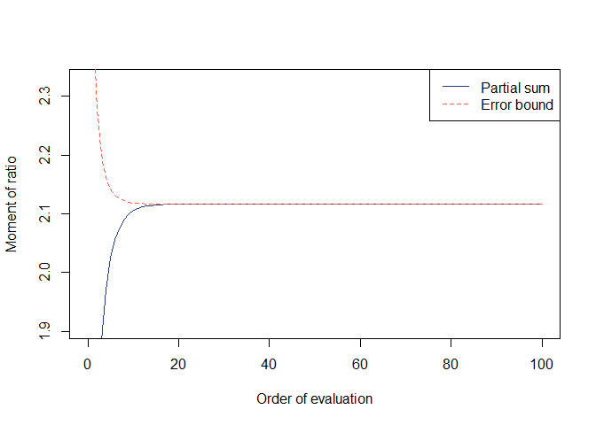
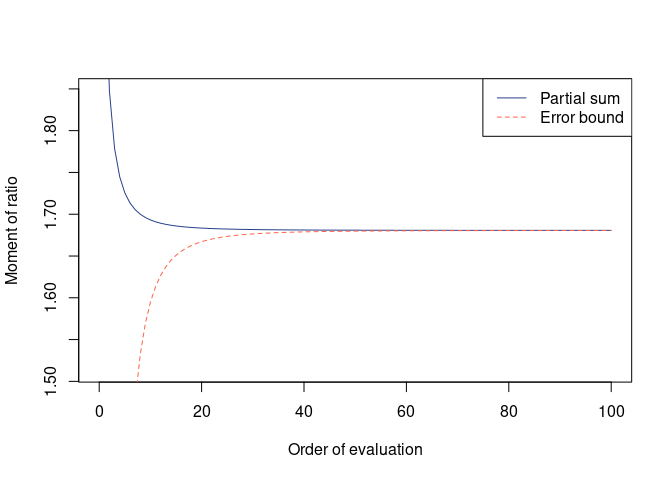
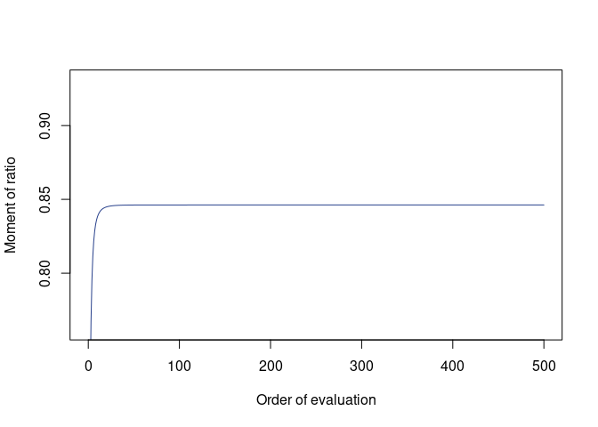
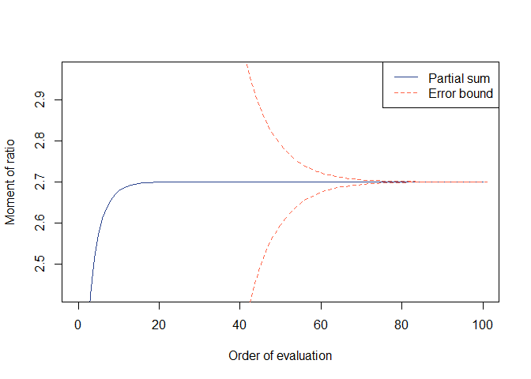

<!-- README.md is generated from README.Rmd. Please edit that file -->

# avrevol: R Package for Average Evolvability Measures

<!-- badges: start -->
<!-- badges: end -->

This small package provides wrapper functions to evaluate average
evolvability measures in evolutionary quantitative genetics, based on
the implementation of recursion-based evaluation of moments of ratios of
quadratic forms in the package
[`qfratio`](https://github.com/watanabe-j/qfratio).

The package `qfratio` provides functions to evaluate moments of ratios
of quadratic forms in normal variables using recursive algorithms. That
package was originally developed for evaluating average evolvability
measures (Watanabe, 2022), but is capable of evaluating moments in
rather general conditions beyond those. The idea of this package is to
provide a simple, convenient interface specifically aiming at average
evolvability measures, by passing appropriately specified arguments to
functions from the `qfratio` package. All average evolvability measures
treated by Watanabe (2022) are implemented, accommodating arbitrary mean
and covariance for the selection gradients.

As a supplement, this package also has functions to obtain Monte Carlo
samples for evolvability measures (including the random skewers
correlation), as well as the delta method approximations for average
evolvability measures by Hansen & Houle (2008). Existing packages like
`evolvability` and `evolqg` have these functionalities, but this
package’s implementation is more general (Monte Carlo versions
accommodate arbitrary mean and covariance) and faster, as of developing
this.

## Installation

``` r
## These dependencies are required if you haven't installed them
# install.packages("devtools")
# devtools::install_github("watanabe-j/qfratio")
devtools::install_github("watanabe-j/avrevol")
```

This package has the following dependencies:

    Imports: qfratio, MASS

## Example

This is a basic example which shows you how to solve a common problem:

``` r
library(avrevol)

## Simple covariance matrices
nv <- 4
G1 <- diag(nv:1)
G2 <- diag(sqrt(1:nv))
nit <- 1000

## Average conditional evolvability using series expression
## Inspect plot to check for convergence
(res_cevo <- avr_cevo(G1))
#> 
#>  Moment of ratio of quadratic forms
#> 
#> Moment = 2.11678, Error = 2.775558e-15 (one-sided)
#> Possible range:
#>  2.11677962 2.11677962
plot(res_cevo)
```



``` r
## Hansen & Houle's (2008) delta method approximation of the same
hh_cevo(G1)
#> [1] 2.11968

## Monte Carlo sample of conditional evolvability
## under spherical distribution of beta,
## and its mean as an estimate of average conditional evolvability
## plus its 95% CI
mcsample_cevo <- mc_cevo(nit, G1)
mean(mcsample_cevo)
#> [1] 2.133323
mean(mcsample_cevo) + sd(mcsample_cevo) / sqrt(nit) *
    qt(c(0.025, 0.975), nit - 1)
#> [1] 2.093725 2.172922

## Average response difference using series expression,
## Hansen-Houle delta method approximation, and
## Monte Carlo estimate
(res_rdif <- avr_rdif(G1, G2))
#> 
#>  Moment of ratio of quadratic forms
#> 
#> Moment = 1.680634, Error = -0.0001131094 (one-sided)
#> Possible range:
#>  1.68052050 1.68063361
plot(res_rdif)
```



``` r
hh_rdif(G1, G2)
#> [1] 1.682945
mean(mc_rdif(nit, G1, G2))
#> [1] 1.686863

## Average response correlation using series expression and
## its Monte Carlo estimate, aka "random skewers" correlation
(res_rcor <- avr_rcor(G1, G2))
#> 
#>  Moment of ratio of quadratic forms
#> 
#> Moment = 0.8462192
#> Error bound unavailable; recommended to inspect plot() of this object
plot(res_rcor)
```



``` r
mean(mc_rcor(nit, G1, G2))
#> [1] 0.8463566

## Advanced: Average evolvability under
## non-spherical distribution of selection gradient
## (the same works for other evolvability measures as well)
mu <- nv:1 / nv
Sigma <- matrix(0.5, nv, nv)
diag(Sigma) <- 1
(res_evol_nsph <- avr_evol(G1, mu = mu, Sigma = Sigma))
#> 
#>  Moment of ratio of quadratic forms
#> 
#> Moment = 2.70034, Error = 5.948518e-05 (two-sided)
#> Possible range:
#>  2.70028007 2.70039904
plot(res_evol_nsph)
```



``` r
mean(mc_evol(nit, G1, mu = mu, Sigma = Sigma))
#> [1] 2.691995
```

## References

Hansen, T. F. & Houle, D. (2008) Measuring and comparing evolvability
and constraint in multivariate characters. *Journal of Evolutionary
Biology*, **21**, 1201–1219. doi:
[10.1111/j.1420-9101.2008.01573.x](https://doi.org/10.1111/j.1420-9101.2008.01573.x).

Marroig, G., Shirai, L. T., Porto A., de Oliveira, F. B., & De Conto, V.
(2009) The evolution of modularity in the mammalian skull II:
evolutionary consequences. *Evolutionary Biology*, **36**, 136–148. doi:
[10.1007/s11692-009-9051-1](https://doi.org/10.1007/s11692-009-9051-1).

Watanabe, J. (2022). Exact expressions and numerical evaluation of
average evolvability measures for characterizing and comparing **G**
matrices. *bioRxiv* preprint, 2022.11.02.514929. doi:
[10.1101/2022.11.02.514929](https://doi.org/10.1101/2022.11.02.514929).
